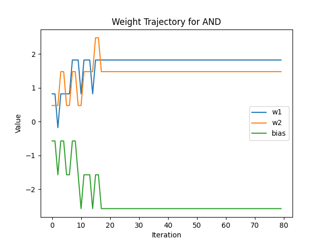
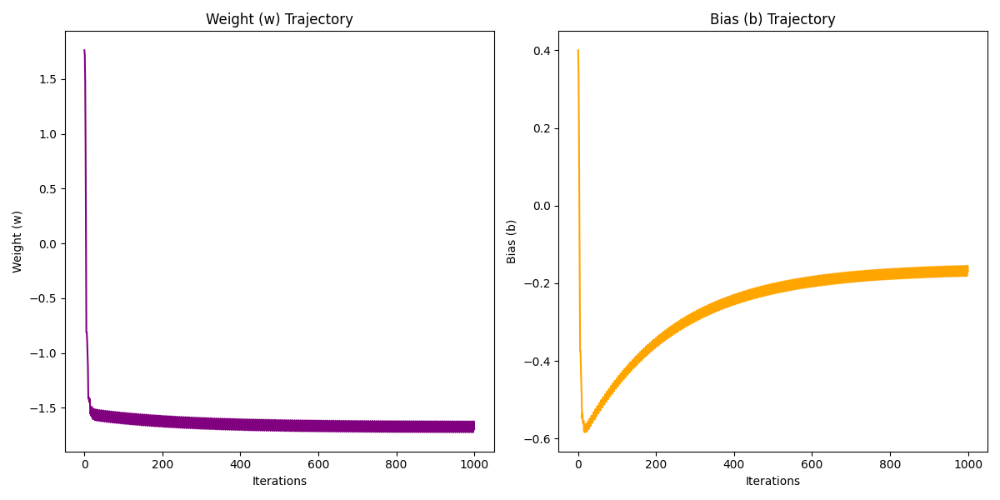

<div align="center">

# 人工智能第一次作业

**220810332  斯蓬**

</div>


# Q1: 

## 问题
感知机的决策边界由以下条件定义：
\[
\phi(v) = \frac{1}{1 + e^{-av}}
\]
其中，\(v = \mathbf{w}^T \mathbf{x} + b\)。观察向量 \(\mathbf{x}\) 属于类 \(C_1\) 当且仅当输出 \(y > \xi\)，即：
\[
\frac{1}{1 + e^{-a(\mathbf{w}^T \mathbf{x} + b)}} > \xi
\]
否则，\(\mathbf{x}\) 属于类 \(C_2\)。

证明决策边界是一个超平面，即满足形如：
\[
\mathbf{w}^T \mathbf{x} + b = 0
\]

---

## 证明

决策条件为：
\[
\frac{1}{1 + e^{-a(\mathbf{w}^T \mathbf{x} + b)}} > \xi
\]
通过取倒数和两边减 1，得到：
\[
1 > \xi(1 + e^{-a(\mathbf{w}^T \mathbf{x} + b)})
\]
展开后化简：
\[
1 > \xi + \xi e^{-a(\mathbf{w}^T \mathbf{x} + b)}
\]

将不等式进一步化简：
\[
1 - \xi > \xi e^{-a(\mathbf{w}^T \mathbf{x} + b)}
\]
两边取对数（在 \(\xi > 0\) 且 \(\xi < 1\) 的条件下，保证对数有效），得到：
\[
\ln(1 - \xi) > \ln(\xi) - a(\mathbf{w}^T \mathbf{x} + b)
\]

移项并整理，得到决策边界满足：
\[
\mathbf{w}^T \mathbf{x} + b = \frac{\ln(\xi) - \ln(1 - \xi)}{a}
\]

由于 \(\ln(\xi) - \ln(1 - \xi)\) 和 \(a\) 都是常数，以上方程是关于 \(\mathbf{x}\) 的线性方程，因此对应的决策边界是一个超平面。

---
# Q2: 

## 问题
XOR 的真值表如下：
\[
\begin{aligned}
x_1 & : 0, 1, 0, 1 \\
x_2 & : 0, 0, 1, 1 \\
y & : 0, 1, 1, 0
\end{aligned}
\]
证明 XOR 问题不能通过单一的线性超平面分割这四个点。

---

## 证明

在二维平面上，四个点分别为：
\[
(0, 0) \to y = 0,\quad (1, 0) \to y = 1,\quad (0, 1) \to y = 1,\quad (1, 1) \to y = 0
\]
这些点的分布如下：
- 类别 \(y = 0\): \((0, 0), (1, 1)\)
- 类别 \(y = 1\): \((1, 0), (0, 1)\)

我们先假设XOR问题可以通过单一的线性超平面分割这四个点，也就是存在一个线性方程：
\[
w_1x_1 + w_2x_2 + b = 0
\]
能够将类别 \(y = 0\) 和 \(y = 1\) 的点分隔开。也就是说，对于每个点 \((x_1, x_2)\)，需要满足以下条件：
\[
\begin{aligned}
& w_1x_1 + w_2x_2 + b > 0 \quad & \text{当 } y = 1 \\
& w_1x_1 + w_2x_2 + b < 0 \quad & \text{当 } y = 0
\end{aligned}
\]

对于上述四个点：
- 对于 \((0, 0)\): \(w_1 \cdot 0 + w_2 \cdot 0 + b < 0\)（\(y = 0\)）
- 对于 \((1, 0)\): \(w_1 \cdot 1 + w_2 \cdot 0 + b > 0\)（\(y = 1\)）
- 对于 \((0, 1)\): \(w_1 \cdot 0 + w_2 \cdot 1 + b > 0\)（\(y = 1\)）
- 对于 \((1, 1)\): \(w_1 \cdot 1 + w_2 \cdot 1 + b < 0\)（\(y = 0\)）

此方程无解，则说明原假设不成立。因此得证。

---

# Q3: 

## (a) 

### 1. AND (与)
- 真值表:
  - \(x_1 = 0, x_2 = 0, y = 0\)
  - \(x_1 = 0, x_2 = 1, y = 0\)
  - \(x_1 = 1, x_2 = 0, y = 0\)
  - \(x_1 = 1, x_2 = 1, y = 1\)
- 权重选择:
  - \(w_1 = 1\), \(w_2 = 1\), 偏置 \(b = -1.5\)
- 决策函数:
  \[
  y = \phi(w_1 x_1 + w_2 x_2 + b)
  \]
  其中 \(\phi(v) = 1\) 如果 \(v > 0\)，否则 \(\phi(v) = 0\)。

### 2. OR (或)
- 真值表:
  - \(x_1 = 0, x_2 = 0, y = 0\)
  - \(x_1 = 0, x_2 = 1, y = 1\)
  - \(x_1 = 1, x_2 = 0, y = 1\)
  - \(x_1 = 1, x_2 = 1, y = 1\)
- 权重选择:
  - \(w_1 = 1\), \(w_2 = 1\), 偏置 \(b = -0.5\)
- 决策函数同上。

### 3. COMPLEMENT (取反)
- 真值表:
  - \(x_1 = 0, y = 1\)
  - \(x_1 = 1, y = 0\)
- 权重选择:
  - \(w_1 = -1\), 偏置 \(b = 0.5\)
- 决策函数同上。

---

## (b)

使用学习算法选择权重
1. **学习规则:**
   - 假设初始权重随机，学习率 \(\eta = 1.0\)。
   - 更新公式:
     \[
     w_i \leftarrow w_i + \eta (y_{\text{target}} - y)x_i
     \]
     \[
     b \leftarrow b + \eta (y_{\text{target}} - y)
     \]
   - 其中 \(y_{\text{target}}\) 为目标输出，\(y\) 为实际输出。
2. **步骤:**
   - 对每个输入样本 \((x, y_{\text{target}})\)，根据公式更新权重。
   - 重复多次迭代，直到所有样本分类正确。
3. **结果:**
   - 绘制权重更新轨迹。
   - 比较(a)中选定的权重，验证学习算法的正确性。

以下是基于 Python 的代码实现：

```python
import numpy as np
import matplotlib.pyplot as plt

def step_function(v):
    return 1 if v > 0 else 0

def perceptron_train(inputs, targets, eta, epochs):
    # 初始化权重和偏置
    weights = np.random.rand(inputs.shape[1])
    bias = np.random.rand()
    weight_history = []

    for epoch in range(epochs):
        for i, x in enumerate(inputs):
            v = np.dot(weights, x) + bias
            y = step_function(v)

            error = targets[i] - y
            weights += eta * error * x
            bias += eta * error

            weight_history.append((weights.copy(), bias))

    return weights, bias, weight_history

# 绘制权重更新轨迹
def plot_weights(weight_history, title, input_dim):
    w1_history = [w[0][0] for w in weight_history]
    if input_dim > 1:
        w2_history = [w[0][1] for w in weight_history]
    else:
        w2_history = None
    bias_history = [w[1] for w in weight_history]

    plt.figure()
    plt.plot(w1_history, label="w1")
    if w2_history is not None:
        plt.plot(w2_history, label="w2")
    plt.plot(bias_history, label="bias")
    plt.title(title)
    plt.xlabel("Iteration")
    plt.ylabel("Value")
    plt.legend()
    plt.show()

# 定义
logic_functions = {
    "AND": {
        "inputs": np.array([[0, 0], [0, 1], [1, 0], [1, 1]]),
        "targets": np.array([0, 0, 0, 1]),
    },
    "OR": {
        "inputs": np.array([[0, 0], [0, 1], [1, 0], [1, 1]]),
        "targets": np.array([0, 1, 1, 1]),
    },
    "COMPLEMENT": {
        "inputs": np.array([[0], [1]]),
        "targets": np.array([1, 0]),
    },
}

# 学习率和迭代次数
eta = 1.0
epochs = 20

for logic, data in logic_functions.items():
    inputs, targets = data["inputs"], data["targets"]
    weights, bias, weight_history = perceptron_train(inputs, targets, eta, epochs)
    print(f"Logic Function: {logic}")
    print(f"Final Weights: {weights}, Final Bias: {bias}")
    plot_weights(weight_history, f"Weight Trajectory for {logic}", inputs.shape[1])
```

迭代图象如下：

<p align="center">
  
  
  
</p>

下面是通过学习得到的权重大小：

Logic Function: AND
Final Weights: [1.8220022  1.47738079], Final Bias: -2.569993835570772
Logic Function: OR
Final Weights: [1.58286597 0.93563415], Final Bias: -0.6871749207189596
Logic Function: COMPLEMENT
Final Weights: [-0.58338171], Final Bias: 0.1491825339874544


我们可以看到虽然学习迭代得到的结果和a中自己求得的结果有所不同，但是经过验证答案都是正确的。
这种不同可能是由学习率设置大小所造成的。

---
## (c)

我们尝试使用线性可分的解决方式来解决XOR问题，下面是部分代码：

```python
# XOR 数据集
inputs = np.array([[0, 0], [0, 1], [1, 0], [1, 1]])  # 输入
targets = np.array([0, 1, 1, 0])  # 目标输出

# 学习率和训练轮数
eta = 1.0
epochs = 10

weights, bias, weight_history = perceptron_train(inputs, targets, eta, epochs)

# 绘制结果
print(f"Final Weights: {weights}, Final Bias: {bias}")
plot_xor(inputs, targets, weights, bias, "XOR with Single-Layer Perceptron")

# 权重轨迹图
w1_history = [w[0][0] for w in weight_history]
w2_history = [w[0][1] for w in weight_history]
bias_history = [w[1] for w in weight_history]

plt.figure()
plt.plot(w1_history, label="w1")
plt.plot(w2_history, label="w2")
plt.plot(bias_history, label="bias")
plt.title("Weight Trajectories for XOR")
plt.xlabel("Iteration")
plt.ylabel("Value")
plt.legend()
plt.show()

```


我们可以看到权重一直保持震荡的状态，无法收敛。
这是因为由于 XOR 问题是线性不可分的问题，感知机无法通过线性权重实现。

---


# Q4：

## (a)

使用LLS解答,算法如下：

1. 输入数据集 \((x_i, d_i)\)。
2. 表达线性模型 \(y = w \cdot x + b\) 为矩阵形式：
   \[
   \mathbf{y} = \mathbf{X} \mathbf{w} + \mathbf{b}
   \]
   其中 \(\mathbf{X}\) 是输入矩阵，\(\mathbf{w}\) 是权重向量。
3. 根据最小二乘法公式求解：
   \[
   \mathbf{w^*} = (\mathbf{X}^T \mathbf{X})^{-1} \mathbf{X}^T \mathbf{d}
   \]


代码如下：
```python
import numpy as np
import matplotlib.pyplot as plt

# 数据集
data = np.array([[0.8, -1], [1.6, -4], [3.0, -5], [4.0, -6], [5.0, -9]])
X = data[:, 0]
d = data[:, 1]

# LLS 方法
X_design = np.vstack([X, np.ones_like(X)]).T  # 构造设计矩阵
w, b = np.linalg.lstsq(X_design, d, rcond=None)[0]  # 求解 w 和 b

# 画出拟合结果
plt.figure(figsize=(8, 6))
plt.scatter(X, d, color="blue", label="Data Points")
plt.plot(X, w * X + b, color="red", label=f"LLS Fit: y = {w:.2f}x + {b:.2f}")
plt.title("Linear Fit using Least Squares Method")
plt.xlabel("x")
plt.ylabel("d")
plt.legend()
plt.grid()
plt.show()
```


得 \(w = -1.6371\) ,\(b = -0.2851\)

---

## (b)

使用LMS算法，步骤如下：

1. 初始化权重 \(w\) 和偏置 \(b\) 。
2. 设置学习率 \(\eta\) 和训练轮次。
3. 对每轮训练：
   - 对每个数据点计算预测值：
     \[
     y_{\text{pred}} = w \cdot x + b
     \]
   - 计算误差：
     \[
     e = d - y_{\text{pred}}
     \]
   - 更新权重和偏置：
     \[
     w \leftarrow w + \eta \cdot e \cdot x,\quad b \leftarrow b + \eta \cdot e
     \]
4. 记录每次迭代的权重 \(w\) 和偏置 \(b\)。
5. 结束训练后绘制拟合结果和权重变化轨迹。

代码如下：
```python
import numpy as np
import matplotlib.pyplot as plt

# 数据集
data = np.array([[0.8, -1], [1.6, -4], [3.0, -5], [4.0, -6], [5.0, -9]])
X = data[:, 0]
d = data[:, 1]

# LMS 方法初始化
np.random.seed(0) 
w_lms, b_lms = np.random.randn(), np.random.randn()  
learning_rate = 0.02
epochs = 200

w_trajectory, b_trajectory = [w_lms], [b_lms]

# LMS 训练
for epoch in range(epochs):
    for i in range(len(X)):
        y_pred = w_lms * X[i] + b_lms
        error = d[i] - y_pred
        w_lms += learning_rate * error * X[i]
        b_lms += learning_rate * error
        w_trajectory.append(w_lms)
        b_trajectory.append(b_lms)

# 画出拟合结果
plt.figure(figsize=(8, 6))
plt.scatter(X, d, color="blue", label="Data Points")
plt.plot(X, w_lms * X + b_lms, color="green", label=f"LMS Fit: y = {w_lms:.2f}x + {b_lms:.2f}")
plt.title("Linear Fit using LMS Algorithm")
plt.xlabel("x")
plt.ylabel("d")
plt.legend()
plt.grid()
plt.show()

# 画出权重和偏置的变化轨迹
plt.figure(figsize=(12, 6))
plt.subplot(1, 2, 1)
plt.plot(w_trajectory, color="purple")
plt.title("Weight (w) Trajectory")
plt.xlabel("Iterations")
plt.ylabel("Weight (w)")

plt.subplot(1, 2, 2)
plt.plot(b_trajectory, color="orange")
plt.title("Bias (b) Trajectory")
plt.xlabel("Iterations")
plt.ylabel("Bias (b)")

plt.tight_layout()
plt.show()
```


得 \(w = -1.6967\) ,\(b = -0.1691\)



通过图象可以看出，权重是收敛的。

---

## (c)

编写代码让两个图象放进同一张图中便于比对

```python
# 画出两种方法的拟合结果
plt.figure(figsize=(8, 6))
plt.scatter(X, d, color="blue", label="Data Points")
plt.plot(X, w * X + b, color="red", label="LLS Fit")
plt.plot(X, w_lms * X + b_lms, color="green", linestyle="--", label="LMS Fit")
plt.title("Comparison of LLS and LMS Methods")
plt.xlabel("x")
plt.ylabel("d")
plt.legend()
plt.grid()
plt.show()
```


从图象上看，两者计算结果的差异并不大。
LLS方法是无需进行学习的解析解，可以直接得到结果，计算效率高。
LMS方法是需要经过大量迭代才能得出结果，虽然在题目中给定了200轮的学习次数，即使权重收敛，但是还是无法完美拟合。

---
# Q5：

   定义误差 \(e^{(i)}\) 为目标值与预测值的差：
   \[
   e^{(i)} = d^{(i)} - \mathbf{w}^T \mathbf{x}^{(i)}
   \]
   则目标函数可写为：
   \[
   J(\mathbf{w}) = \sum_{i=1}^n r(i) \cdot \left(e^{(i)}\right)^2 = \sum_{i=1}^n r(i) \cdot \left(d^{(i)} - \mathbf{w}^T \mathbf{x}^{(i)}\right)^2
   \]

   \[
   J(\mathbf{w}) = \sum_{i=1}^n r(i) \cdot \left[\left(d^{(i)}\right)^2 - 2 d^{(i)} \mathbf{w}^T \mathbf{x}^{(i)} + \left(\mathbf{w}^T \mathbf{x}^{(i)}\right)^2\right]
   \]
   为最小化 \(J(\mathbf{w})\)，对 \(\mathbf{w}\) 求导并令其为零：
   \[
   \frac{\partial J(\mathbf{w})}{\partial \mathbf{w}} = -2 \sum_{i=1}^n r(i) d^{(i)} \mathbf{x}^{(i)} + 2 \sum_{i=1}^n r(i) \mathbf{x}^{(i)} \mathbf{x}^{(i)T} \mathbf{w}
   \]
   整理后得到：
   \[
   \sum_{i=1}^n r(i) \mathbf{x}^{(i)} \mathbf{x}^{(i)T} \mathbf{w} = \sum_{i=1}^n r(i) d^{(i)} \mathbf{x}^{(i)}
   \]

   定义加权输入矩阵和输出向量：
   \[
   \mathbf{X} = \begin{bmatrix}
   \mathbf{x}^{(1)} \\
   \mathbf{x}^{(2)} \\
   \vdots \\
   \mathbf{x}^{(n)}
   \end{bmatrix}, \quad
   \mathbf{R} =
   \begin{bmatrix}
    r{(1)} & 0   & \cdots & 0 \\
    0   & r{(2)} & \cdots & 0 \\
    \vdots & \vdots & \ddots & \vdots \\
    0   & 0   & \cdots & r{(n)}
   \end{bmatrix},\quad
   \mathbf{D} = \begin{bmatrix}
   d^{(1)} \\
   d^{(2)} \\
   \vdots \\
    d^{(n)}
   \end{bmatrix}
   \]
   则最优权重向量为：
   \[
   \mathbf{w^*} = \left(\mathbf{X}^T \mathbf{R} \mathbf{X}\right)^{-1} \mathbf{X}^T \mathbf{R} \mathbf{D}
   \]

