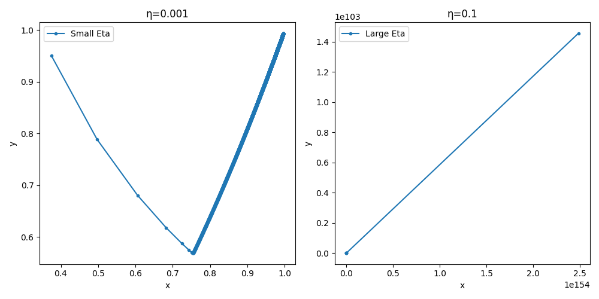
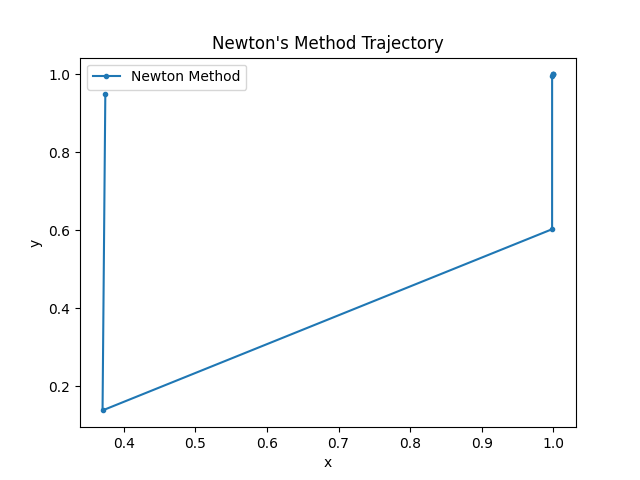
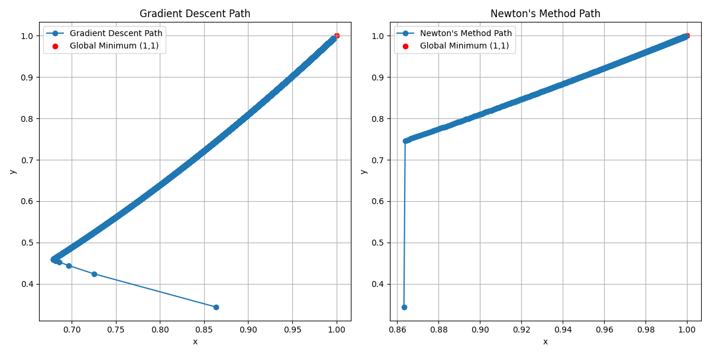
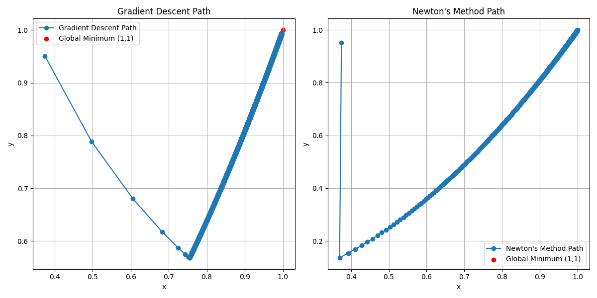
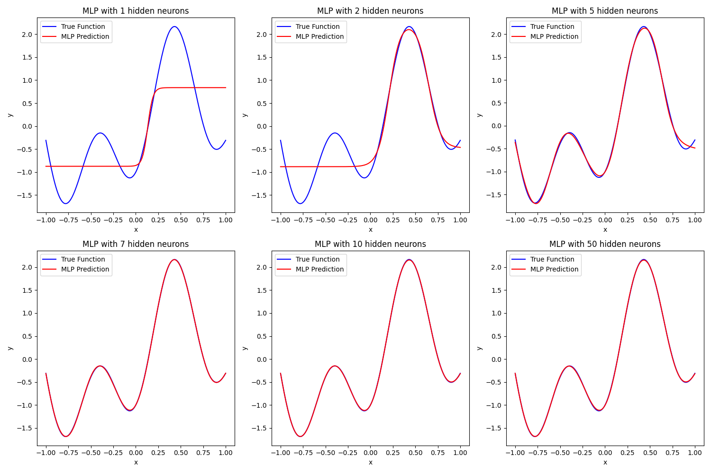
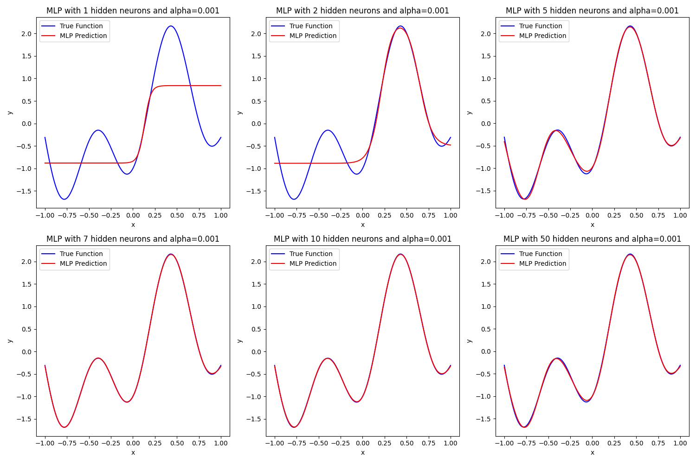

<div align="center">

# 人工智能第二次作业

**220810332  斯蓬**

</div>

# Q1. Rosenbrock's Valley Problem
## a）梯度下降法

**公式**：  
  \[
  w(k + 1) = w(k) - \eta g(k)
  \]  
  梯度：
  \[
f(x, y) = (1 - x)^2 + 100(y - x^2)^2
\]  
  \[
\frac{\partial f}{\partial x} = -2(1 - x) - 400x(y - x^2)
\]
\[
\frac{\partial f}{\partial y} = 200(y - x^2)
\]

**初始条件**：随机生成起点 \((x, y) \in (0, 1)\)
  
**结果**：
收敛路径和函数值变化如下图所示（代码见代码附录**ex1-1**）：



**分析**：
使用学习率 \(\eta = 0.001\)，梯度下降法需要约**10,000次迭代**（未完全收敛）。
从图中可以看到，路径逐渐靠近全局最小值 (1,1)，**较小的学习率收敛效果很好但收敛速度很慢**。
使用学习率 \(\eta = 0.1\)，过大的步幅导致更新不稳定，有时甚至远离目标点。**学习率过高使梯度下降无法收敛**。

## b）牛顿法

**公式**：  
  \[
  \Delta w(n) = -H^{-1}(n)g(n)
  \]  
  其中 Hessian 矩阵：
  \[
  H(x, y) = \begin{bmatrix}
  2 - 400(y-x^2) + 1200x^2 & -400x \\
  -400x & 200
  \end{bmatrix}
  \]  

**结果**：
  牛顿法在 **3 次迭代** 后成功收敛到全局最小值。收敛路径和函数值变化如下图所示：



**分析**：

**牛顿法收敛速度明显快于梯度下降法，但计算成本高（需要计算 Hessian 矩阵）。**
然而，这种方法对初始点敏感。不同的初始点导致的迭代次数可能差别很大。

我们将随机生成初始点的种子改变再次查看，并且和梯度下降法进行对比（代码见代码附录**ex1-2**）：


显示梯度下降法迭代次数约**7289次**，牛顿法迭代次数为**1081次**

  显示梯度下降法迭代次数约**10000次**，牛顿法的迭代次数变为**932次**。

牛顿法在Rosenbrock函数这样非凸情况下，还可能需要**精确计算Hessian**以保证稳定。

---

# Q2. Function Approximation

## a）使用顺序模式与 BP 算法

我们使用以下公式生成训练集和测试集：

训练集：
\[
x_{\text{train}} \in [-1, 1], \ \Delta x = 0.05
\]
\[
y_{\text{train}} = 1.2 \sin(\pi x_{\text{train}}) - \cos(2.4 \pi x_{\text{train}})
\]

测试集：
\[
x_{\text{test}} \in [-1, 1], \ \Delta x = 0.01
\]
\[
y_{\text{test}} = 1.2 \sin(\pi x_{\text{test}}) - \cos(2.4 \pi x_{\text{test}})
\]

使用BP算法得如下图象(代码见代码附录**ex2**)：



分析上面的图象，随着 \(n\) 的逐渐增大，得到的模型曲线越来越向原曲线拟合，从 \(n=5\)  开始几乎拟合，后续继续增大n也同样拟合。
这与课堂PPT中的结果近似吻合。
由此我们可以得到大致结果：

**隐藏神经元的影响**:
  - 当隐藏神经元数量较少（ 1-4 个）时，模型表现出明显的欠拟合，无法很好地捕捉函数的波动特性。
  - 随着隐藏神经元的增加（ 5-10 个），模型逐渐逼近目标函数，表现出良好的拟合效果。
  - 当隐藏神经元数量过多（ 50 个）时，模型可能表现出轻微的过拟合，尽管测试集表现不错，但可能在范围外的点上泛化较差。

**输入范围外的预测**
我们对不同的n和不同的随机生成数来预测得到了如下的结果：

x = -1.5, y = -1.648439739328338
x = 1.5, y = 1.1841377182622872

x = -1.5, y = -1.5884982476616067
x = 1.5, y = 1.3645857371708703

x = -1.5, y = 6.731550909706876
x = 1.5, y = 1.5962476395544183

可以看到差距非常大，因此**MLP并不能在训练集限定的输入范围之外进行合理的预测**。


## b）使用批量模式与正则化

添加了正则化项 \( \alpha = 0.001 \)，得到了如下图象：

可以看出在添加了正则化后，当\(n=5\)开始模型就有较好的拟合度。
说明**添加正则化项后通过更小的\(n\)可以取得更好的训练效果**，同时可以减少**过拟合**的出现。

**总结：**
- 隐藏神经元数量的选择至关重要，应在欠拟合与过拟合之间取得平衡。
- 正则化能够有效提升模型的泛化能力，在测试集及范围外点上有更优表现。
- MLP并不能在训练集限定的输入范围之外进行合理的预测

# 代码附录

## Q1
### ex1-1
```python
import numpy as np
import matplotlib.pyplot as plt

def rosenbrock(x, y):
    return (1 - x)**2 + 100 * (y - x**2)**2

def gradient(x, y):
    df_dx = -2 * (1 - x) - 400 * x * (y - x**2)
    df_dy = 200 * (y - x**2)
    return np.array([df_dx, df_dy])

def gradient_descent(eta, tol=1e-6, max_iter=10000):
    np.random.seed(42)
    x, y = np.random.rand(2)  # 随机初始化
    trajectory = [(x, y)]
    for _ in range(max_iter):
        grad = gradient(x, y)
        x, y = x - eta * grad[0], y - eta * grad[1]
        trajectory.append((x, y))
        if np.linalg.norm(grad) < tol:
            break
    return np.array(trajectory)

# 参数
eta_small = 0.001
eta_large = 0.1

# 运行梯度下降
trajectory_small = gradient_descent(eta_small)
trajectory_large = gradient_descent(eta_large)

# 绘制轨迹
plt.figure(figsize=(10, 5))
plt.subplot(1, 2, 1)
plt.plot(trajectory_small[:, 0], trajectory_small[:, 1], marker='o', markersize=3, label='Small Eta')
plt.title("Small Learning Rate (η=0.001)")
plt.xlabel("x")
plt.ylabel("y")
plt.legend()

plt.subplot(1, 2, 2)
plt.plot(trajectory_large[:, 0], trajectory_large[:, 1], marker='o', markersize=3, label='Large Eta')
plt.title("Large Learning Rate (η=0.1)")
plt.xlabel("x")
plt.ylabel("y")
plt.legend()

plt.tight_layout()
plt.show()

def hessian(x, y):
    d2f_dx2 = 2 - 400 * (y - 3 * x**2)
    d2f_dy2 = 200
    d2f_dxdy = -400 * x
    return np.array([[d2f_dx2, d2f_dxdy], [d2f_dxdy, d2f_dy2]])

def newton_method(tol=1e-6, max_iter=10000):
    np.random.seed(42)
    x, y = np.random.rand(2)
    trajectory = [(x, y)]
    for _ in range(max_iter):
        grad = gradient(x, y)
        hess = hessian(x, y)
        delta = np.linalg.solve(hess, -grad)
        x, y = x + delta[0], y + delta[1]
        trajectory.append((x, y))
        if np.linalg.norm(grad) < tol:
            break
    return np.array(trajectory)

trajectory_newton = newton_method()

# 绘制牛顿法轨迹
plt.figure()
plt.plot(trajectory_newton[:, 0], trajectory_newton[:, 1], marker='o', markersize=3, label='Newton Method')
plt.title("Newton's Method Trajectory")
plt.xlabel("x")
plt.ylabel("y")
plt.legend()
plt.show()
```
### ex1-2
```python
import numpy as np
import matplotlib.pyplot as plt

# 定义 Rosenbrock 函数及其梯度和 Hessian 矩阵
def rosenbrock(x, y):
    return (1 - x)**2 + 100 * (y - x**2)**2

def rosenbrock_gradient(x, y):
    grad_x = -2 * (1 - x) - 400 * x * (y - x**2)
    grad_y = 200 * (y - x**2)
    return np.array([grad_x, grad_y])

def rosenbrock_hessian(x, y):
    hxx = 2 - 400 * (y - x**2) + 1200 * x**2
    hxy = -400 * x
    hyy = 200
    return np.array([[hxx, hxy], [hxy, hyy]])

# 梯度下降法实现
def gradient_descent(start, learning_rate, tol=1e-6, max_iter=10000):
    path = [start]
    x, y = start
    for _ in range(max_iter):
        grad = rosenbrock_gradient(x, y)
        x, y = np.array([x, y]) - learning_rate * grad
        path.append([x, y])
        if rosenbrock(x, y) < tol:
            break
    return np.array(path), len(path) - 1

# 牛顿法实现
def newton_method(start, tol=1e-6, max_iter=10000):
    path = [start]
    x, y = start
    for _ in range(max_iter):
        grad = rosenbrock_gradient(x, y)
        hess = rosenbrock_hessian(x, y)
        step = np.linalg.solve(hess, grad)
        x, y = np.array([x, y]) - step
        path.append([x, y])
        if rosenbrock(x, y) < tol:
            break
    return np.array(path), len(path) - 1

# 设置初始条件
np.random.seed(42)
start_point = np.random.rand(2)  # 随机初始化点 (x, y) ∈ (0, 1)

# 梯度下降法
path_gd, iter_gd = gradient_descent(start=start_point, learning_rate=0.001)

# 牛顿法
path_newton, iter_newton = newton_method(start=start_point)

# 绘图
plt.figure(figsize=(12, 6))

# 梯度下降法路径图
plt.subplot(1, 2, 1)
x_vals, y_vals = path_gd[:, 0], path_gd[:, 1]
plt.plot(x_vals, y_vals, marker="o", label="Gradient Descent Path")
plt.scatter(1, 1, color="red", label="Global Minimum (1,1)")
plt.title("Gradient Descent Path")
plt.xlabel("x")
plt.ylabel("y")
plt.legend()
plt.grid()

# 牛顿法路径图
plt.subplot(1, 2, 2)
x_vals, y_vals = path_newton[:, 0], path_newton[:, 1]
plt.plot(x_vals, y_vals, marker="o", label="Newton's Method Path")
plt.scatter(1, 1, color="red", label="Global Minimum (1,1)")
plt.title("Newton's Method Path")
plt.xlabel("x")
plt.ylabel("y")
plt.legend()
plt.grid()

plt.tight_layout()
plt.show()

# 输出迭代次数
print(iter_gd, iter_newton)
```

## Q2
### ex2
```python
import numpy as np
from sklearn.neural_network import MLPRegressor
import matplotlib.pyplot as plt

# 生成训练集
x_train = np.arange(-1, 1.05, 0.05)
y_train = 1.2 * np.sin(np.pi * x_train) - np.cos(2.4 * np.pi * x_train)

# 生成测试集
x_test = np.arange(-1, 1.01, 0.01)
y_test = 1.2 * np.sin(np.pi * x_test) - np.cos(2.4 * np.pi * x_test)


# 定义隐藏神经元数量
hidden_neurons = [1, 2, 5, 7, 10, 50]

# 创建一个大图，2行3列
fig, axes = plt.subplots(2, 3, figsize=(15, 10))

# 将axes展平，方便按顺序访问
axes = axes.flatten()

for i, n in enumerate(hidden_neurons):
    # 创建MLP模型
    mlp = MLPRegressor(hidden_layer_sizes=(n,), activation='tanh',
                        solver='lbfgs', max_iter=5000,
                        random_state=123)
    
    # 训练模型
    mlp.fit(x_train.reshape(-1, 1), y_train)
    
    # 预测测试集
    y_pred = mlp.predict(x_test.reshape(-1, 1))
    
    # 在对应的子图里画图
    axes[i].plot(x_test, y_test, label='True Function', color='blue')
    axes[i].plot(x_test, y_pred, label='MLP Prediction', color='red')
    axes[i].set_title(f'MLP with {n} hidden neurons')
    axes[i].set_xlabel('x')
    axes[i].set_ylabel('y')
    axes[i].legend()
    
# 调整布局
plt.tight_layout()

# 显示图形
plt.show()
# 定义范围外的输入
x_extrap = np.array([-1.5, 1.5]).reshape(-1, 1)

# 预测
y_extrap = mlp.predict(x_extrap)

print(f'x = -1.5, y = {y_extrap[0]}')
print(f'x = 1.5, y = {y_extrap[1]}')

# 创建一个大图，2行3列
fig, axes = plt.subplots(2, 3, figsize=(15, 10))

# 将axes展平，方便按顺序访问
axes = axes.flatten()

for i, n in enumerate(hidden_neurons):
    # 创建带有正则化的MLP模型
    mlp = MLPRegressor(hidden_layer_sizes=(n,), activation='tanh',
                        solver='lbfgs', max_iter=5000, alpha=0.001,
                        random_state=123)
    
    # 训练模型
    mlp.fit(x_train.reshape(-1, 1), y_train)
    
    # 预测测试集
    y_pred = mlp.predict(x_test.reshape(-1, 1))
    
    # 在对应的子图里画图
    axes[i].plot(x_test, y_test, label='True Function', color='blue')
    axes[i].plot(x_test, y_pred, label='MLP Prediction', color='red')
    axes[i].set_title(f'MLP with {n} hidden neurons and alpha=0.001')
    axes[i].set_xlabel('x')
    axes[i].set_ylabel('y')
    axes[i].legend()
    
# 调整布局
plt.tight_layout()

# 显示图形
plt.show()

```